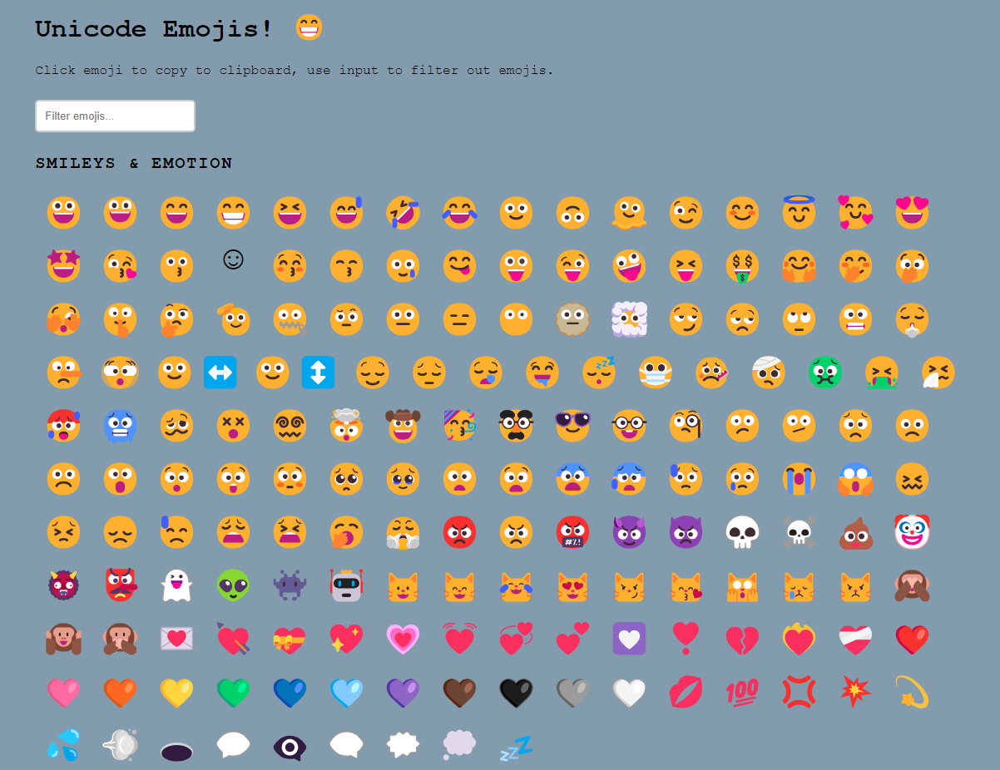

# Unicode emojis parser 🤩

Copy your favorite emojis to clipboard with this single tool by clicking!

## But why..?

I needed unicode emojis for my movie quizz and wanted an easy way to list, filter and copy them. Existing pages usually forced another page load when emoji was clicked so it was too cumbersome. The keywords and explanations are a bit too vague at the moment for effective filtering. But it's a start!

## Prerequisites and installing

### note: if you are never going to parse emojis/update them and want to use the ones included with the repo, then you can skip the steps below

Before running this project, you need to have [Node.js](https://nodejs.org/en/download/) installed.

After installation run `npm install`.

## Parse emojis from unicode source

Run `npm run parse-emojis`. This will fetch emoji definitions from unicode.org and you should do this only when you want to update the existing json list.

## Opening the page

Run `npm run open`. This will open index.html in your default browser. Not necessary step as you can just click the index.html, but hey, I'm lazy 😴.
